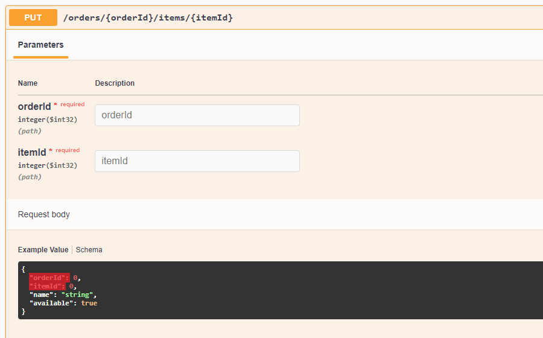

# Swashbuckle.AspNetCore.CleanRequests

[](https://www.nuget.org/packages/Swashbuckle.AspNetCore.CleanRequests)

A library with additional filters for Swashbuckle.AspNetCore to exclude duplicated information from schema.

## Introduction

Well designed RESTful APIs often use nesting on endpoints to show relationships between entities, so it's easier to understand them. In addition many modern web applications use Mediator pattern to achieve loose coupling between objects (see [MediatR](https://github.com/jbogard/MediatR) library for example implementation). An example RESTful request is shown below.

```csharp
[HttpPut("{orderId:int}/items/{itemId:int}")]
public ActionResult<int> UpdateOrderItem(int orderId, int itemId,
    [FromBody] UpdateOrderItemRequest request)
{
    request.OrderId = orderId;
    request.ItemId = itemId;

    // ...
}
```



The problem is that both the URL and the `UpdateOrderItemRequest` class contain `orderId` and `itemId`, while only the URL values are used. Unfortunately Swagger doesn't know that, so you have to deal with it manually. You can create an additional class without duplicated properties, put it into the endpoint definition and map it to the `UpdateOrderItemRequest`, or you can use this library to exclude duplicates.

### **Important**

The library is designed with the assumption that request classes are used only once per request.
It means that you should not use `UpdateOrderItemRequest` for different requests.

## Installation

Install [Nuget package](https://www.nuget.org/packages/Swashbuckle.AspNetCore.CleanRequests) into your ASP.NET Core application.

### Package Manager

```
Install-Package Swashbuckle.AspNetCore.CleanRequests -Version {version}
```

### .NET CLI

```
dotnet add package --version {version} Swashbuckle.AspNetCore.CleanRequests
```

## Usage

1. Install [Swashbuckle.AspNetCore Nuget package](https://github.com/domaindrivendev/Swashbuckle.AspNetCore)
2. In the `ConfigureServices` method of `Startup.cs` search for `AddSwaggerGen` call and register the filters. Define where to look for duplicates using `ParameterLocation` enum (the default value is `ParameterLocation.Path`).

   ```cssharp
   builder.Services.AddSwaggerGen(options =>
   {
       options.ExcludeDuplicatedBodyProperties(ParameterLocation.Path);
       options.ExcludeDuplicatedQueryParameters(ParameterLocation.Path);
   });
   ```

3. Now you can start your application and check out the schemas.

## Contributing

Pull requests are welcome. For major changes, please open an issue first to discuss what you would like to change.

## License

[MIT](https://choosealicense.com/licenses/mit/)
